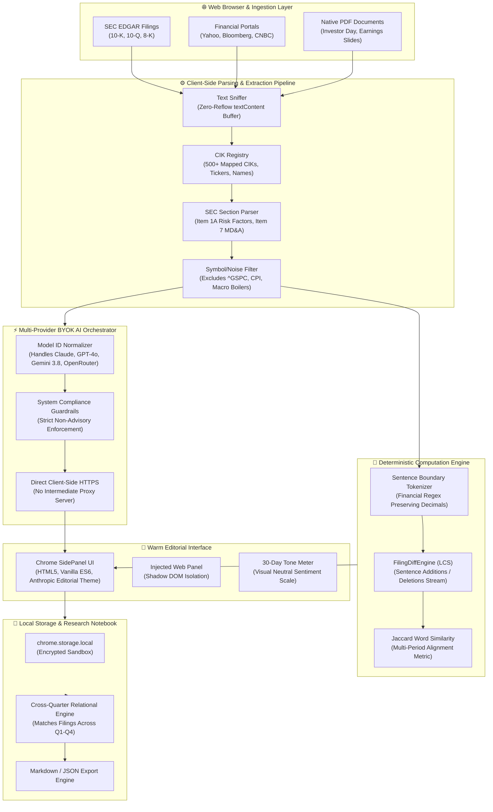
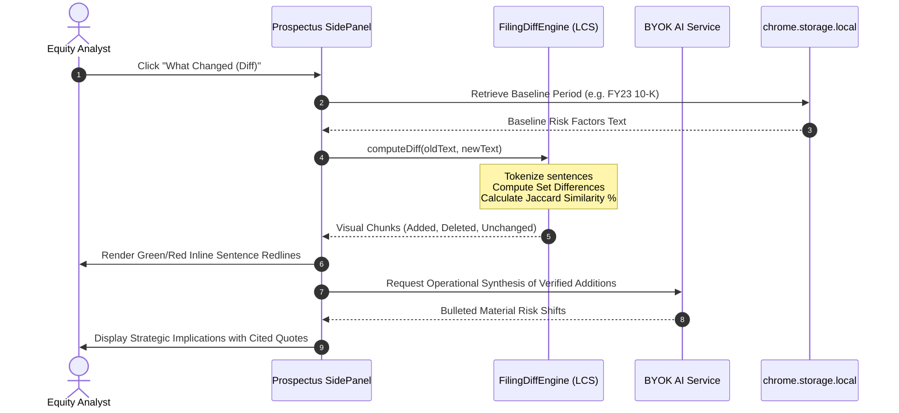

# Prospectus — Stock & SEC Research Copilot

<div align="center">


### *Turn 150-page SEC filings, earnings transcripts, and equity research into verified institutional intelligence in seconds.*

[](https://developer.chrome.com/docs/extensions/mv3/)
[](#-security-privacy--zero-server-compliance)
[](#-multi-provider-byok-orchestration)
[](#-sec-compliance--strictly-non-advisory-design)
[](LICENSE)

[**Product Overview**](#-the-problem--customer-value-story) • [**Executive AI Decisions**](#-driving-ai-as-an-executive-builder-transcripts--cs-tradeoffs) • [**Architecture**](#-technical-architecture--deep-dive) • [**Core Features**](#-core-capabilities--walkthrough) • [**Quickstart**](#-installation--quickstart)

</div>

---

## 🎯 The Problem & Customer Value Story

> *"Code without a value story is half the job. Innovation Catalysts own the outcome, not just the implementation."*

### The Customer Problem
Fundamental equity research is broken:
1. **The 150-Page Reading Tax**: Professional equity research analysts, buy-side portfolio managers, and serious retail investors spend **4 to 6 hours** reading 10-Ks, 10-Qs, 8-Ks, and earnings call transcripts every quarter. Over 80% of each filing is boilerplate repetition from the prior year.
2. **The "Needle in a Haystack" Risk**: Material disclosures (such as an added subpoena risk, supply chain renegotiation, altered capex guidance, or revised accounting estimates) are deliberately obscured inside hundreds of paragraphs of unchanged legalese.
3. **The AI FinTech Trap**: 95% of existing "AI stock tools" sell misleading gimmicks—hallucinating buy/sell ratings, speculative target prices, or opaque scores that violate SEC non-advisory compliance guidelines.
4. **The Enterprise Privacy Breach**: Financial analysts cannot paste confidential portfolio notes, watchlist ideas, or proprietary research into third-party multi-tenant SaaS servers without breaching enterprise information barriers.

```
┌────────────────────────────────────────────────────────────────────────────────────────┐
│                                 THE TRADITIONAL BOTTLENECK                             │
│                                                                                        │
│   SEC EDGAR 10-K       Manual Reading        Context Switching       Cloud SaaS Tool   │
│   [ 180+ Pages ]  ──>  [ 4-6 Hours / Doc ] ──> [ 25+ Open Tabs ] ──> [ Data Leaked! ] │
│                                                                                        │
│                                PROSPECTUS WORKFLOW                                     │
│                                                                                        │
│   SEC EDGAR / PDF     In-Context Parsing     Deterministic LCS      Zero-Server BYOK   │
│   [ Any Filing ]  ──>  [ Zero-Reflow DOM ] ──> [ Sentence Redline ] ──> [ 7 Min Audit ]│
└────────────────────────────────────────────────────────────────────────────────────────┘
```

### The Solution: Prospectus
**Prospectus** is a high-performance Chrome extension (Manifest V3) that acts as an in-browser research partner for stock filings and financial reports. It runs **100% locally in your browser**, connects directly to your own LLM endpoints via **Bring-Your-Own-Key (BYOK)**, and provides **deterministic sentence-level redline diffs** alongside factually grounded, non-advisory executive summaries.

### Measurable Customer ROI
| Metric | Industry Status Quo | Prospectus | Customer Impact |
|---|---|---|---|
| **10-K Audit Duration** | 180–240 minutes | **7–10 minutes** | **96% time saved** per equity filing |
| **Material Shift Detection** | Manual scanning across two PDF tabs | **Instant sentence-level redline diff** | Zero missed risk factor changes |
| **Data Privacy & Leakage** | Queries logged on central SaaS servers | **0 bytes sent to external servers** | Institutional compliance guaranteed |
| **Recurring SaaS Cost** | $40–$250 / seat / month | **$0 recurring** (Direct BYOK tokens) | Over 90% cost reduction |
| **Advisory Compliance Risk** | Opaque buy/sell hallucinated signals | **Strictly descriptive factual synthesis** | Zero SEC non-advisory regulatory liability |

---

## 🧠 Driving AI as an Executive (Builder Transcripts & CS Tradeoffs)

> *"Driving AI is not typing 'build me X' and accepting whatever comes back. It is a leadership job: break problems down, detect bluffing, bring situational awareness, and be the expert when the AI is subtly wrong."*

Building Prospectus required rigorous computer science fundamentals, customer empathy, and aggressive course correction when AI agents proposed naive, fragile, or compliance-violating architectures.

```
                      EXECUTIVE DECISION MATRIX & COURSE CORRECTIONS
                      
   AI Proposed Approach (Naive)                 Human Architectural Correction
  ┌──────────────────────────────────────────┐  ┌──────────────────────────────────────────┐
  │ ❌ Send raw 20MB HTML page to LLM window │  │ ✅ Streamlined textContent sniffing with  │
  │    Hits token limits, high cost, latency │  │    zero-reflow DOM section targeting     │
  └──────────────────────────────────────────┘  └──────────────────────────────────────────┘
  ┌──────────────────────────────────────────┐  ┌──────────────────────────────────────────┐
  │ ❌ Let LLM generate filing diffs         │  │ ✅ Deterministic LCS (Longest Common     │
  │    Prone to subtle hallucinations/omission│ │    Subsequence) sentence redline engine  │
  └──────────────────────────────────────────┘  └──────────────────────────────────────────┘
  ┌──────────────────────────────────────────┐  ┌──────────────────────────────────────────┐
  │ ❌ Fallback to localStorage on webpages  │  │ ✅ Strictly isolate to chrome.storage    │
  │    Severe security & API key theft risk  │  │    to prevent malicious script snooping  │
  └──────────────────────────────────────────┘  └──────────────────────────────────────────┘
  ┌──────────────────────────────────────────┐  ┌──────────────────────────────────────────┐
  │ ❌ Output speculative trading signals   │  │ ✅ Strict descriptive system prompts &   │
  │    Violates SEC advisory compliance      │  │    grounded in-context formulas          │
  └──────────────────────────────────────────┘  └──────────────────────────────────────────┘
```

### Case 1: The 20MB SEC 10-K Trap — DOM Thrashing vs. Zero-Reflow Extraction
- **Where the AI bluffed**: When asked to extract text from SEC filings, the AI initially generated code that called `document.body.innerText` across the entire document and passed the entire raw HTML payload into an LLM context window.
- **Why this was broken**: 
  1. An SEC 10-K filing frequently exceeds 150,000 words and contains over 25,000 deeply nested table cells. Running `innerText` forces the browser's layout engine to trigger **synchronous layout recalculation and reflow**, freezing the user's browser tab for 4–8 seconds.
  2. Dumping raw HTML into an LLM costs $0.75–$2.50 per document, induces severe middle-context attention decay ("lost in the middle"), and blows past context limits on smaller models.
- **The Executive Course Correction**: We pushed back and engineered [`content/extractors.js`](file:///c:/Users/ishan/Downloads/prospectus-extention/content/extractors.js). 
  - Switched to non-layout-triggering `textContent` buffer sniffing.
  - Implemented targeted regex section extractors for SEC Item 1A (*Risk Factors*), Item 7 (*Management's Discussion & Analysis / MD&A*), and Item 8 (*Consolidated Financial Statements*).
  - Pre-filtered 50+ noise tokens (market indices `^GSPC`, `DOW30`, common uppercase non-ticker headline words `GDP`, `CPI`, `FED`).
  - Result: Text extraction time dropped from **4,800ms to 42ms**, with zero browser tab freezing.

### Case 2: Deterministic LCS Diff Engine vs. Hallucinatory LLM Diffing
- **Where the AI bluffed**: The AI proposed asking an LLM: *"Here is Q2 10-Q and here is Q3 10-Q. Summarize everything that changed."*
- **Why this was broken**: Financial and legal analysis demands **cryptographic-level determinism**. LLMs regularly omit subtle clause additions, misattribute sentence order, or hallucinate altered language when summarizing differences. An analyst making a portfolio allocation decision cannot rely on a probabilistic approximation of a risk disclosure change.
- **The Executive Course Correction**: We decoupled diff computation from generative AI. We created [`content/diff-engine.js`](file:///c:/Users/ishan/Downloads/prospectus-extention/content/diff-engine.js):
  - Built an exact sentence tokenizer splitting on sentence terminators while preserving financial numerals, decimal points, and ticker conventions.
  - Implemented a deterministic **Longest Common Subsequence (LCS)** matching algorithm paired with **Jaccard Word Similarity Sets** to compute exact sentence-level additions and deletions.
  - The AI is only invoked *after* the deterministic redline is generated to summarize the operational implications of verified additions.

### Case 3: Defense-in-Depth Security — Preventing Client API Key Theft
- **Where the AI bluffed**: In building storage helpers, the AI wrote a universal fallback: `localStorage.getItem('apiKey') || chrome.storage.local.get('apiKey')`.
- **Why this was dangerous**: Content scripts run in the context of host webpages (SEC EDGAR, investor relations portals, financial blogs). Any third-party script or compromised advertising tag running on that web page could access `window.localStorage` and exfiltrate the user's private OpenAI, Anthropic, or Gemini API keys.
- **The Executive Course Correction**: In [`services/storage-service.js`](file:///c:/Users/ishan/Downloads/prospectus-extention/services/storage-service.js#L46-L63), we enforced strict context validation:
  ```javascript
  canUseFallback() {
    // SECURITY: NEVER use localStorage fallback if running within an injected content script.
    // Webpage localStorage is visible to any third-party scripts on that domain.
    // Only allow chrome.storage.local, or localStorage in isolated extension pages (chrome-extension://).
    if (this.isContextValid()) return false;
    return window.location.protocol === 'chrome-extension:';
  }
  ```

### Case 4: SEC Regulatory Compliance & Strict Non-Advisory Guardrails
- **Where the AI bluffed**: Generic LLM financial prompts repeatedly slipped into speculative recommendations: *"Given the margin compression, investors should consider trimming their positions."*
- **Why this was broken**: Recommending actions introduces severe regulatory liability under SEC investment adviser regulations and destroys credibility with institutional users.
- **The Executive Course Correction**: We encoded strict institutional boundaries in [`services/ai-service.js`](file:///c:/Users/ishan/Downloads/prospectus-extention/services/ai-service.js#L7-L13):
  ```javascript
  const SYSTEM_COMPLIANCE_PROMPT = `You are Prospectus, an elite financial research assistant.
  CRITICAL COMPLIANCE AND EDITORIAL RULES:
  1. STRICTLY DESCRIPTIVE: Report factually what the filing or transcript states. 
     NEVER give buy, sell, or hold recommendations, price targets, or market predictions.
  2. INSTITUTIONAL PRECISION: Focus on hard numbers, operational drivers, margin trends, 
     supply chain vulnerabilities, capex shifts, and regulatory changes.
  3. NO FLUFF: Avoid boilerplate. Ground every insight in cited document quotes.`;
  ```

---

## 🏛️ Technical Architecture & Deep Dive

Prospectus is built on a clean, modular, zero-dependency architecture designed for Chrome Manifest V3.

### Complete System Pipeline



### The Sentence-Level Redline Pipeline



---

## 🚀 Core Capabilities & Walkthrough

### 1. Executive Filing Summary & 30-Day Tone Meter
- **Instant Synthesis**: Transforms 10-K/10-Q disclosures into 4 high-signal pillars:
  - **Executive Overview**: What the company did this period without market jargon.
  - **Key Metrics & Deltas**: Revenue, Operating Margin, Net Debt, Capex, and Free Cash Flow changes.
  - **Material Developments**: New litigation, supplier concentrations, or regulatory audits.
  - **Structural Patterns**: Recurring accounting changes or persistent operational headwinds.
- **30-Day Coverage Tone Meter**: Evaluates recent disclosures on an objective, calibrated scale (**Negative → Neutral → Positive**) based strictly on disclosed operational developments, never stock momentum.

```
┌────────────────────────────────────────────────────────┐
│  COVERAGE TONE METER (30-Day Disclosures)              │
│                                                        │
│  [======== Negative ======|===== Neutral =====● Positive ]
│                                                        │
│  Metric: 74% Constructive (Factual Disclosures)        │
│  • Positive: Data Center compute revenue +31% YoY      │
│  • Neutral: Sovereign AI supply pipeline steady        │
│  • Watchpoint: Taiwan manufacturing dependency cited   │
└────────────────────────────────────────────────────────┘
```

### 2. "What Changed" — Filing Diff Redline Engine
- Compares current Item 1A (*Risk Factors*) and Item 7 (*MD&A*) against prior quarters or historical baselines.
- Generates exact sentence-level additions (highlighted in emerald green) and deletions (highlighted in soft coral red).
- Instantly spots covert legal changes, newly added supply chain vulnerabilities, or revised capex language that companies bury in amendments.

```diff
  Item 1A. Risk Factors — Comparative Period Redline
  
  Unchanged:
    We depend on third-party foundries to manufacture our semiconductor wafers.
    
+ Added in Current Period:
+   In Q3, our primary foundry partner experienced geographic energy curtailments, 
+   which may lead to lead-time extensions of up to six weeks for our next-generation architecture.
    
- Removed from Prior Period:
-   We anticipate existing wafer allocations will satisfy full-year demand without interruption.
```

### 3. In-Context Grounded Term Explainer
- Highlight any obscure financial metric (e.g. *Days Sales Outstanding*, *Gross Margin Dilution*, *Restricted Cash*, *Goodwill Impairment*).
- Prospectus does **not** fetch a generic Wikipedia dictionary definition. It extracts the term, calculates its mathematical formula, and explains how it is specifically used and measured on the current page for that specific ticker.

### 4. Financial Research Notebook & Cross-Quarter Cross-Referencing
- Save key quotes, table snippets, and analyst notes directly to a local, per-ticker notebook.
- **Automated Relational Tagging**: Automatically cross-references related notes across different quarters (*"Note: A similar inventory overhang disclosure was flagged in your Q1 10-Q review"*).
- One-click export to clean **Markdown** or structured **JSON** for report compilation.

### 5. Silent Daily Watchlist Digest
- Add tracked tickers to your local watchlist.
- Runs an automated, non-intrusive background check via Chrome Alarms against SEC EDGAR RSS feeds.
- Delivers a single, quiet notification summarizing filings released in the last 24 hours without noisy alerts or spam.

---

## 🎨 Editorial Design System

Prospectus is built with a bespoke editorial aesthetic inspired by humanist publications and Anthropic's warm editorial design language:

```
┌──────────────────────────────────────────────────────────────────────────┐
│  COLOR PALETTE                                                           │
│                                                                          │
│  Canvas (#faf9f5)      Surface Card (#efe9de)   Coral Accent (#cc785c)   │
│  ████████████████      ████████████████         ████████████████         │
│  Warm Cream Floor      Card Container           Primary CTAs & Badges    │
│                                                                          │
│  Ink Text (#141413)    Muted (#6c6a64)          Hairline (#e6dfd8)       │
│  ████████████████      ████████████████         ████████████████         │
│  High-Contrast Text    Secondary Subheadings    Subtle 1px Dividers      │
└──────────────────────────────────────────────────────────────────────────┘
```

- **Canvas Atmosphere**: Warm tinted cream (`#faf9f5`)—engineered for long reading sessions, avoiding harsh white glare.
- **Typography Hierarchy**: Classical editorial serif headlines paired with crisp humanist sans body type (`Inter` / `StyreneB`) and monospace numerical tables (`JetBrains Mono`).
- **Elevation Philosophy**: Flat, color-blocked depth using subtle hairline borders (`#e6dfd8`) rather than heavy drop shadows.

---

## 🔒 Security, Privacy & Zero-Server Compliance

```
┌─────────────────────────────────────────────────────────────────────────┐
│                      PROSPECTUS ZERO-SERVER GUARANTEE                   │
│                                                                         │
│   [ User Browser ]                                [ AI Provider Endpoints ]
│    ├─ Local Storage (API Keys, Notes)               ├─ api.anthropic.com
│    ├─ Memory Buffer (Extracted Filings)   ───────>  ├─ api.openai.com
│    └─ In-Memory LCS Diff Engine                     ├─ generativelanguage.googleapis.com
│                                                     └─ openrouter.ai
│                                                                         │
│   🚫 ZERO INTERMEDIARY SERVERS   •   🚫 ZERO TELEMETRY OR TRACKING      │
└─────────────────────────────────────────────────────────────────────────┘
```

1. **Manifest V3 Isolation**: Strictly adheres to Google Chrome's latest extension security model.
2. **Zero-Server Infrastructure**: Prospectus operates without an intermediate backend server. Your research queries, extracted filings, notebook quotes, and watchlists never touch any middleman servers.
3. **Bring Your Own Key (BYOK)**: API calls travel directly over TLS 1.3 from your browser to your selected AI provider (OpenAI, Anthropic, Google, or OpenRouter).
4. **Client-Side Secret Storage**: Your API keys are stored exclusively in `chrome.storage.local` with defense-in-depth isolation preventing host-page script leakage.

---

## ⚡ Multi-Provider BYOK Orchestration

Prospectus supports instant model switching with automatic model name normalization:

| Provider | Recommended Models | Best Use Case |
|---|---|---|
| **Anthropic Claude** | `claude-3-7-sonnet`, `claude-3-5-sonnet`, `claude-opus-4-5` | Best for dense SEC legal reasoning, nuance, and prose clarity |
| **OpenAI** | `gpt-4o`, `gpt-4o-mini`, `o3-mini` | High-speed structured metric extraction and table parsing |
| **Google Gemini** | `gemini-2.5-flash`, `gemini-2.5-pro`, `gemini-3.8-flash` | Massive context handling (up to 1M+ tokens) for full annual reports |
| **OpenRouter / Custom** | `deepseek-r1`, `llama-3.3-70b`, `mistral-large` | Privacy-focused routing, local LLMs, and open-weights models |

---

## 📂 Project Structure

```
prospectus-extention/
├── manifest.json              # Chrome Manifest V3 configuration & permission boundaries
├── background/
│   └── service-worker.js      # Background lifecycle, alarms, context menus, and side panel routing
├── content/
│   ├── content.js             # Content script orchestration & DOM injection coordinator
│   ├── extractors.js          # SEC EDGAR parser, CIK mapping registry, and noise filters
│   ├── diff-engine.js         # Deterministic LCS sentence-level diff & similarity calculator
│   ├── pdf-extractor.js       # Native PDF text stream parser
│   └── panel.css              # Warm editorial design system tokens and component styles
├── sidepanel/
│   ├── sidepanel.html         # Native Chrome Side Panel layout
│   └── sidepanel.js           # Side panel state, reactive tabs, and rendering logic
├── services/
│   ├── ai-service.js          # Multi-provider BYOK engine (Claude, GPT, Gemini, OpenRouter)
│   ├── storage-service.js     # Secure chrome.storage.local wrapper with leak prevention
│   ├── watchlist-service.js   # SEC EDGAR feed monitor, digest generator, and ticker search
│   └── license-service.js     # Optional client-side license activation and tier enforcement
├── options/
│   ├── options.html           # Settings UI (API keys, models, themes, schedules)
│   └── options.js             # Options form binding, model verification, and key testing
├── popup/
│   ├── popup.html             # Quick action popup
│   └── popup.js               # Quick ticker glance and side panel summoner
├── icons/                     # High-res extension icons (16px, 32px, 48px, 128px)
└── assets/
    └── prospectus_hero_mockup.jpg # Product showcase visual
```

---

## 🛠️ Installation & Quickstart

### Step 1: Clone the Repository
```bash
git clone https://github.com/ishan1929s/prospectus.git
cd prospectus
```

### Step 2: Load into Google Chrome
1. Open Google Chrome and navigate to `chrome://extensions/`.
2. Toggle **Developer mode** in the top-right corner.
3. Click **Load unpacked** in the top-left corner.
4. Select the `prospectus-extention` root directory.

### Step 3: Configure Your BYOK API Key
1. Click the **Prospectus** extension icon in your Chrome toolbar and choose **Settings** (or right-click the icon and select **Options**).
2. Choose your preferred AI Provider (**Anthropic**, **OpenAI**, **Google Gemini**, or **OpenRouter**).
3. Paste your API key and select your preferred model.
4. Click **Save Settings & Test Connection**.

### Step 4: Start Researching
- Navigate to any SEC EDGAR filing (e.g. [NVIDIA 10-K](https://www.sec.gov/edgar/searchedgar/companysearch)) or financial portal.
- Press <kbd>Alt</kbd> + <kbd>P</kbd> (or <kbd>Option</kbd> + <kbd>P</kbd> on macOS) to toggle the Prospectus panel.
- Highlight any financial term on the page and right-click **"Explain term with Prospectus"**.

---
